# Русификатор The Guild 1 Remake: Europa 1410

**Полный русский перевод** игры The Guild 1 Remake: Europa 1410 (ремейк первой «Гильдии») для Steam. Переведён весь текст игры: интерфейс, обучение, события, подсказки, энциклопедия, должности, законы, товары и реплики персонажей.

**[Скачать русификатор](https://github.com/sincess1/the-guild-1-remake-europa-1410-rusifikator/releases/latest)** — ZIP, 4 МБ · версия 1.0.0 · для игры 0.4.0.25448 (ранний доступ) · [зеркало на SteamGate](https://steamgate.online/ru/blog/the-guild-1-remake-europa-1410-rusifikator?utm_source=github&utm_medium=readme&utm_campaign=guild1410)

Сделан командой [SteamGate.online](https://steamgate.online/ru?utm_source=github&utm_medium=readme&utm_campaign=guild1410) — все новинки Steam в день выхода.

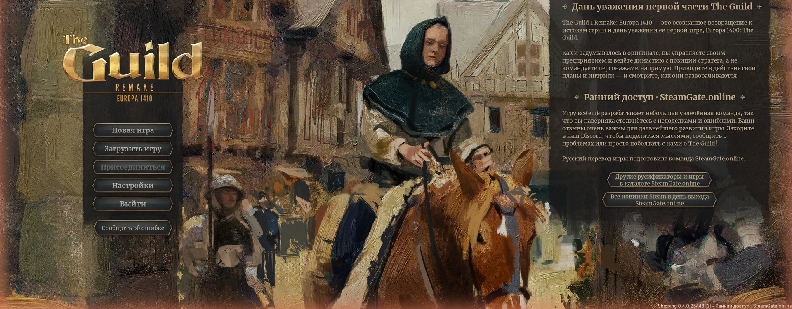

## Что переведено

- **7 328 строк игры, около 55 тысяч слов** — 100% текста, который игра отдаёт на перевод.
- **Ещё 261 строка**, которую игра на перевод не отдаёт: кнопки, подписи и подсказки, зашитые прямо в меню и скрипты. Их нет даже в официальном немецком переводе.
- Правильные падежи и склонения чисел: «1 династия, 3 династии, 12 династий», «Накопите 200 000 богатства».
- Русская типографика: кавычки-«ёлочки», тире, неразрывные пробелы, числа с пробелами.

## Качество перевода

Это не машинный подстрочник, а литературная адаптация под эпоху и жанр:

- единый словарь терминов: должности, здания, товары и законы называются одинаково во всей игре;
- каждая строка проверена: переменные, теги, формы множественного числа, переносы, длина текста под размер кнопок;
- перевод проверен в самой игре: меню, обучение, создание династии, городские палаты, торговля, подсказки.

## Установка (2 шага)

1. **Скопируйте файлы в папку игры.** В Steam: правый клик по игре → Управление → Просмотреть локальные файлы. Перетащите в открывшуюся папку папку `Europa1410` из архива и согласитесь на объединение папок. В `Europa1410\Content\Paks` появятся 6 файлов `Europa1410-Windows_RU_P.*` и `Europa1410-Windows_RUBanner_P.*`.
2. **Выберите русский язык.** В игре: Settings → Gameplay → Text Language → **Русский (Russian)** → Apply. Интерфейс сразу станет русским. Перезапустите игру, чтобы перевелось всё до последней строки.

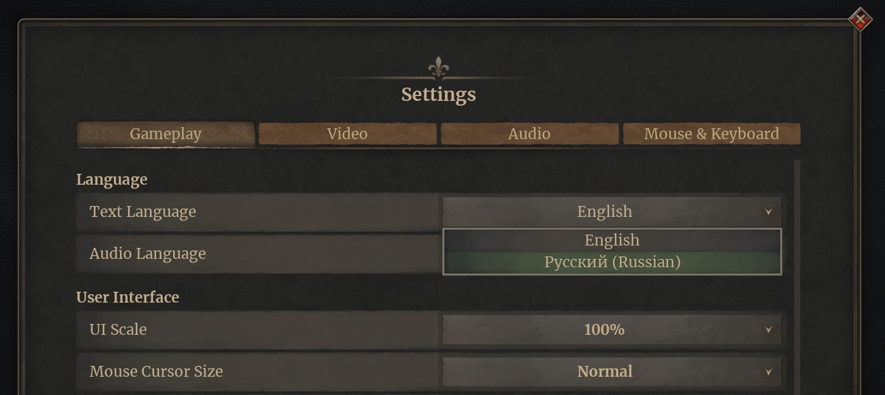

Больше ничего не нужно: ни параметров запуска, ни правки файлов настроек, ни установщика. Русский стоит в списке языков вместо немецкого.

«Язык озвучки» (Audio Language) оставьте English: русской озвучки в игре нет, а пункт «Русский» там включает немецкую.

## Скриншоты

| | |
|:-:|:-:|
| 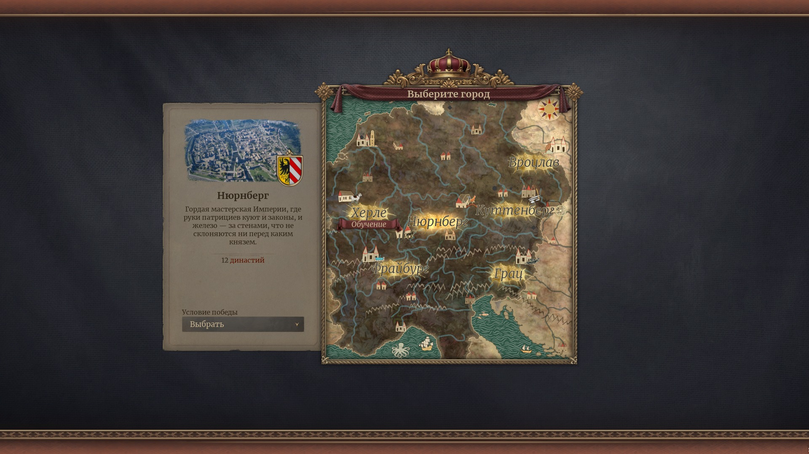 Выбор города | 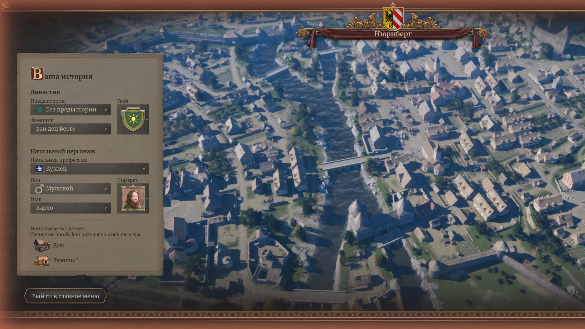 Создание династии |
| 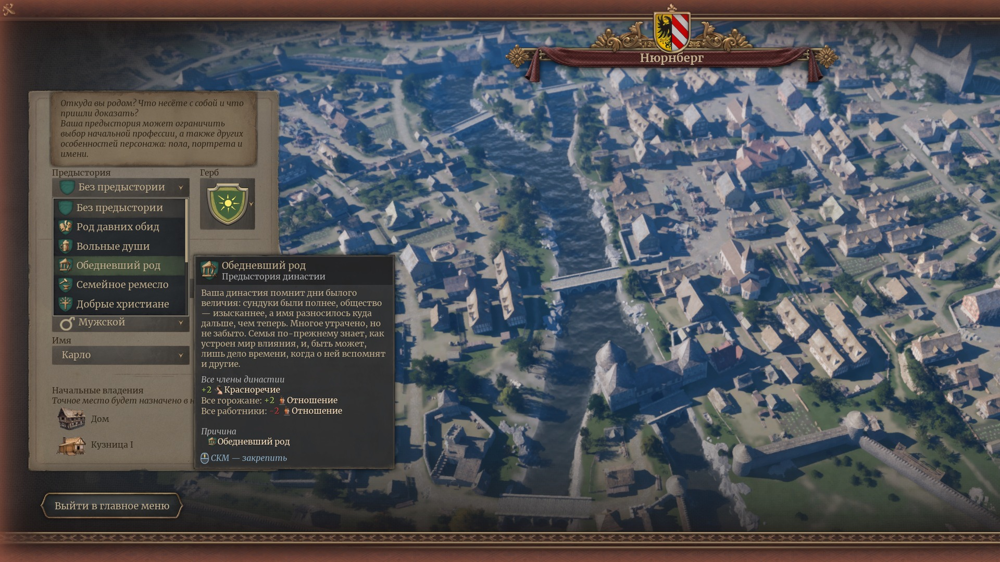 Предыстория и подсказки | 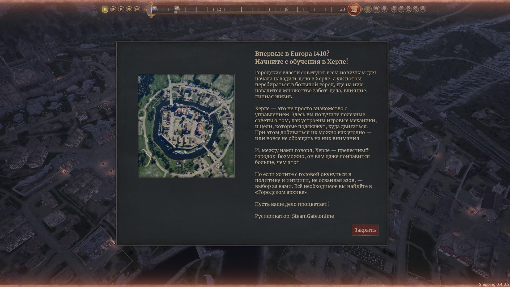 Обучение |
| 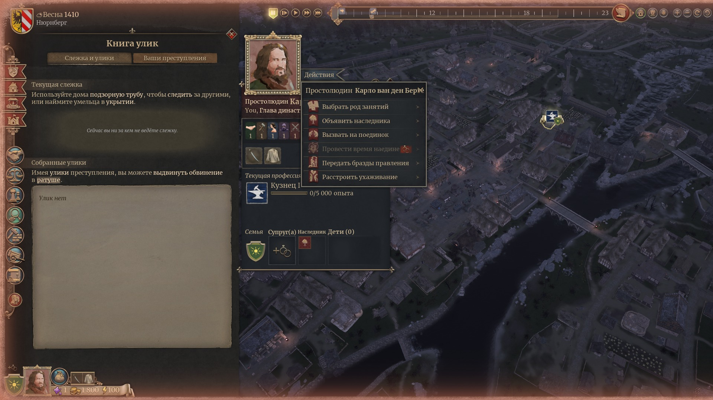 Книга улик | 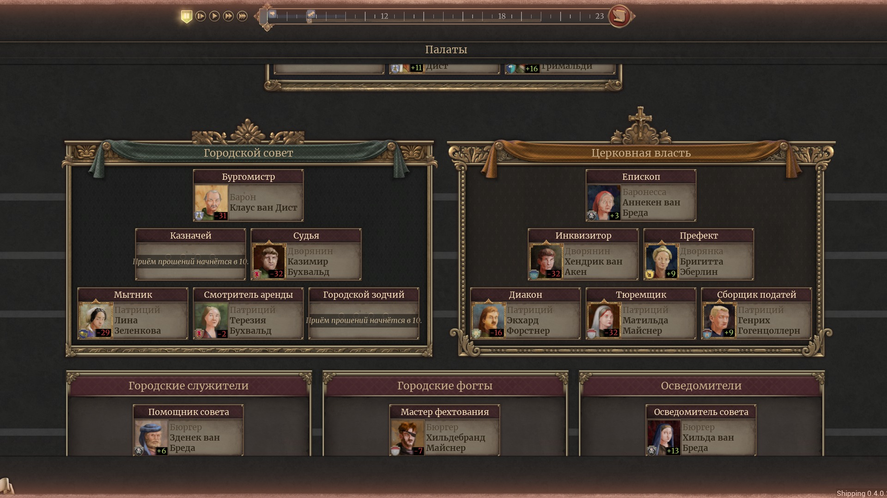 Городские палаты |
| 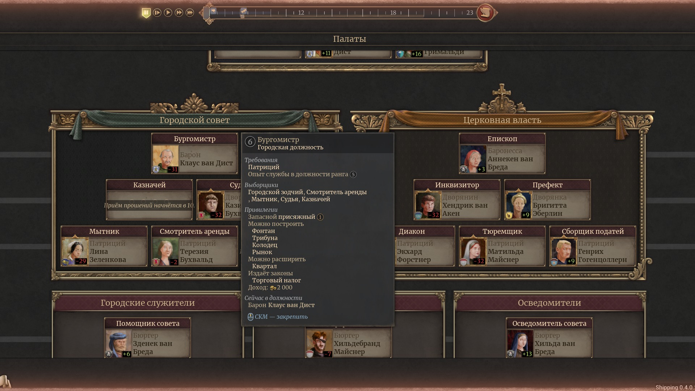 Должность бургомистра | 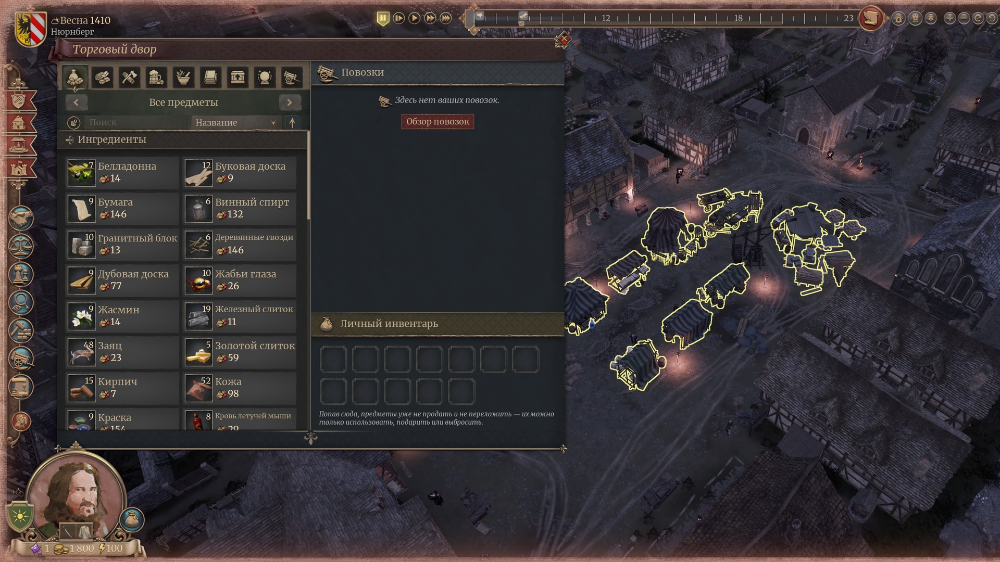 Торговый двор |
| 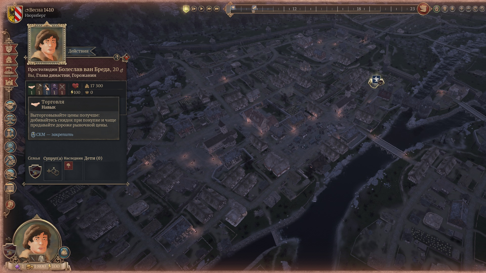 Панель персонажа | 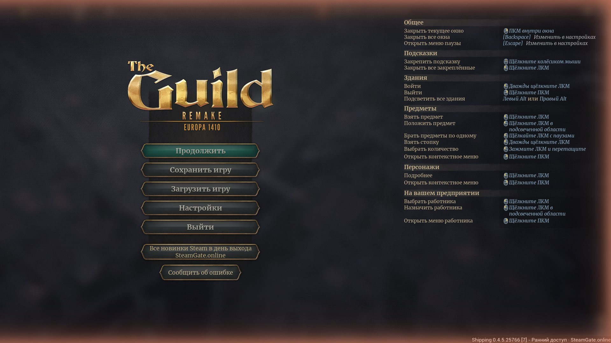 Меню паузы |

## Вопросы и ответы

**Как включить русский язык в The Guild 1 Remake: Europa 1410?**
Официального русского в игре нет, только английский и немецкий. Поставьте этот русификатор и выберите «Русский (Russian)» в Settings → Gameplay → Text Language.

**Это безопасно?**
В архиве нет программ и exe-файлов — только 6 файлов с данными, которые игра подхватывает сама. Файлы игры не изменяются. Русификатор ничего не собирает и никуда не отправляет.

**Сохранения не пропадут?**
Нет, русификатор не трогает сохранения.

**Игра обновилась, что делать?**
Перевод продолжит работать, а новые строки, которые добавят разработчики, будут на английском, пока мы их не переведём. Свежая версия — в разделе [Releases](https://github.com/sincess1/the-guild-1-remake-europa-1410-rusifikator/releases). Если после обновления странно ведёт себя главное меню, удалите три файла `Europa1410-Windows_RUBanner_P.*` (кнопки меню и логотип).

**Остался ли где-то английский?**
Только то, что зашито в код игры и файлами не переводится: переключатели ON/OFF у двух настроек и заглушки «TBD», которые разработчики ещё не заполнили. Всё остальное на русском.

**У меня стоял другой русификатор.**
Удалите его файлы из папки `Europa1410\Content\Paks` (например, `RussianLocalization_P.pak`, `.utoc`, `.ucas`), иначе переводы будут мешать друг другу.

**Почему в меню кнопки со ссылками на SteamGate.online?**
Русификатор бесплатный. Взамен в главном меню и меню паузы есть кнопки на наш сайт SteamGate.online, а в нескольких местах указано, кто сделал перевод. Во время игры ничего не всплывает и не мешает.

**Как удалить русификатор?**
В игре выберите English в Settings → Gameplay → Text Language и закройте игру. Затем удалите 6 файлов `Europa1410-Windows_RU*_P.*` из папки `Europa1410\Content\Paks`. Если удалить файлы, не переключив язык, игра запустится на немецком: выберите English в Einstellungen → Gameplay → Textsprache.

**Нашли ошибку в переводе?**
Напишите в [Issues](https://github.com/sincess1/the-guild-1-remake-europa-1410-rusifikator/issues): приложите скриншот и опишите, где встретилась строка.

## English

Russian translation (rusifikator) for The Guild 1 Remake: Europa 1410 (Steam, Early Access 0.4.0). Download the ZIP from [Releases](https://github.com/sincess1/the-guild-1-remake-europa-1410-rusifikator/releases/latest), copy the `Europa1410` folder into the game folder, then choose «Русский (Russian)» in Settings → Gameplay → Text Language. Russian replaces the German entry in the language list; no launch options or installer needed.

## Ищут также

русификатор The Guild 1 Remake Europa 1410 · русификатор The Guild Europa 1410 · The Guild Remake на русском · The Guild 1 Remake русский язык · Europa 1410 русификатор · Гильдия ремейк русификатор · Гильдия Европа 1410 на русском · Die Gilde Europa 1410 русский · как включить русский язык в The Guild 1 Remake · как установить русификатор The Guild Europa 1410 · скачать русификатор The Guild 1 Remake бесплатно · русская локализация The Guild Remake · перевод The Guild Europa 1410 · русик The Guild · руссификатор The Guild · The Guild 1 Remake Russian translation · Europa 1410 Russian language · The Guild Remake rusifikator

---

Неофициальный фанатский перевод. The Guild 1 Remake: Europa 1410 и все права на игру принадлежат THQ Nordic и Ashborne Games. Для игры нужна купленная копия в Steam.

Все новинки Steam в день выхода — [SteamGate.online](https://steamgate.online/ru?utm_source=github&utm_medium=readme&utm_campaign=guild1410)
